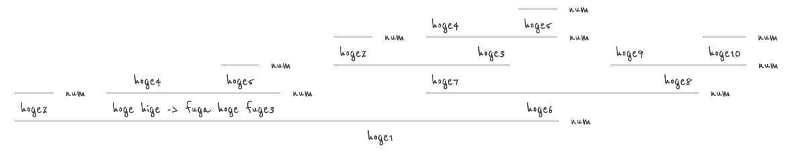

# proof-tree

Draws the proof tree according to given JSON file.



# How to use
1. just copy files in src ( or clone this repository )
   - there should be `index.html`, `yourScript.js`, `yourStyle.css`, `proofTree.js` and `proofTree.css`.
1. Customize it!
   - Dont't touch `proofTree.js` and `proofTree.css`.
   - Customize `index.html`, `yourScript.js` and `yourStyle.css`
     - Basically, it just draws the given proof tree to the given DOM element.

## renderProofTree function
The only function you will use is the `renderProofTree`.
Here is the code from `yourScript.js`.

```javascript
window.addEventListener('DOMContentLoaded', ( event ) => {
    const yourDOMElement = document.getElementById( "proof-tree" ); // <- custamize here
    renderProofTree( yourDOMElement, yourJSON );
});

const yourJSON =
      { /* Here comes yourJSONFile */ }

```

## JSON format
The proof tree must be given with the JSON file.
Here is the format.

```
{'consequent': "Here comes the consequent",
 'rule': "Here is the rule neme to derive the consequent. Give an empty string if you dont't want to show the name",
 'antecedents': [ // Here comes the antecendents. you MUST give an empty list even this is an axiom if you gave a rule name.
    {'consequent': "Hypothesis" } // If you ommit the rule, then it won't show the horizontal bar (and antecedents) on the consequent.
    {'consequent': "Axiom",
     'rule': "" // If you want the bar to be drawn, you MUST give a rule name. If you dont't want to show the name, just give an empty string.
     'antecedents': []
     }
}
```
Have a look at `yourScript.js` file for more example.


